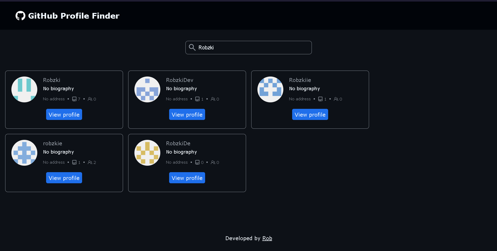
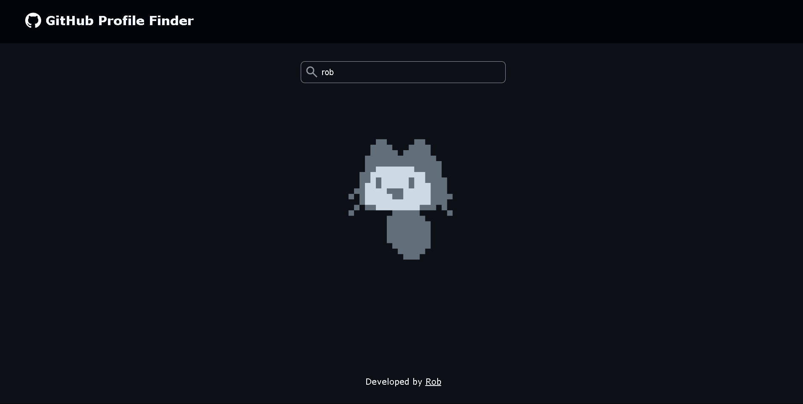

# 👤 GitHub Profile Finder

A web app **GitHub Profile Finder** built with **JavaScript, Webpack, and the MVC pattern**. The app allows users to search for GitHub profiles and view relevant details like repositories, followers, and other profile information.

---

## 🚀 Features
✅ Search for GitHub users by username  
✅ Displays the **searched results** that are matched from username  
✅ Displays **user details** (name, bio, location, followers)  
✅ Shows **user repositories** and **user followers**  
✅ Implements **loading indicator** while searching for users  
✅ Displays **messages** when searching a user if there are no results  
✅ Built using **Webpack** with modular **MVC architecture**  
✅ Loads different **user profile** from **GitHub API**  
✅ Links the **profiles** to its github profile link  

---

## 🖥️ Samples

##### Searching a user with results

##### Loading animation when fetching users

---

## 🛠️ Technologies Used
- **JavaScript (ES6+)**
- **Webpack** for module bundling
- **HTML & CSS** for UI design
- **GitHub API** for fetching profile data
- **Numeral.js** for formatting numbers in number of repositories and followers
- **Octokit.js** for requesting/fething GitHub API data

---

## 📂 Project Structure

    📦 github-profile-finder-app
        ├── 📂 dist
        ├── 📂 node_modules
        ├── 📂 src
        │       ├── 📂 api # Fetches data from GitHub API using Octokit.js as API client
        │       │       └── github.api.js
        │       │
        │       ├── 📂 assets
        │       │       └── 📂 images
        │       │               ├── 📂 gif
        │       │               └── 📂 icons
        │       │
        │       ├── 📂 controllers # Controls app logic
        │       │       └── profile.controller.js 
        │       │
        │       ├── 📂 models # Handles data
        │       │       └── profile.model.js 
        │       │
        │       ├── 📂 utils # Utilities
        │       │       └── helpers.js
        │       │
        │       ├── 📂 views # Handles UI updates
        │       │       └── profile.view.js
        │       │
        │       ├── index.html
        │       ├── index.js
        │       └── styles.css
        │       
        ├── .babelrc
        ├── .env
        ├── .gitignore
        ├── package-lock.json
        ├── package.json
        ├── README.md
        └── webpack.config.js

---

## 🔧 Installation

1. Clone the repository:
    `git clone https://github.com/RobLaran/GitHub-Profile-Finder.git`
    `cd GitHub-Profile-Finder`

  

2. Create *.env* file and add your github access token inside
    `TOKEN="YOUR-GITHUB-TOKEN"`

2. Install dependencies:
    `npm install`  

  
  
3. Run the development server:
    `npm run serve`
    
  

4. Open your browser and visit [localhost:8080](http://localhost:8080) to see the app in action.
